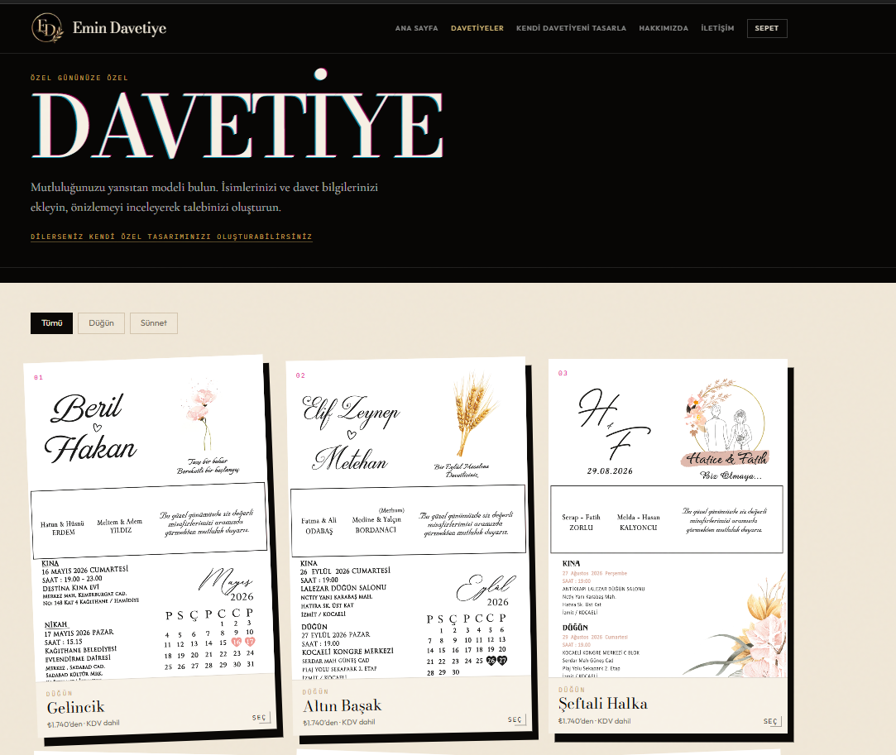
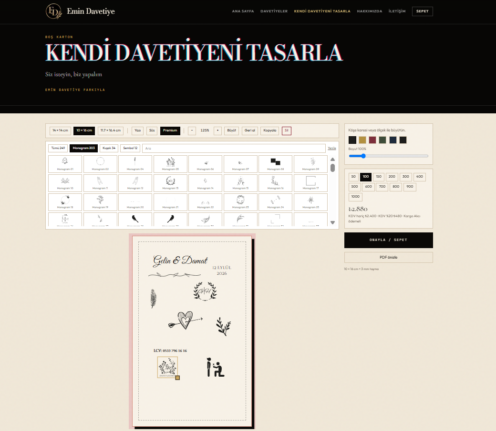
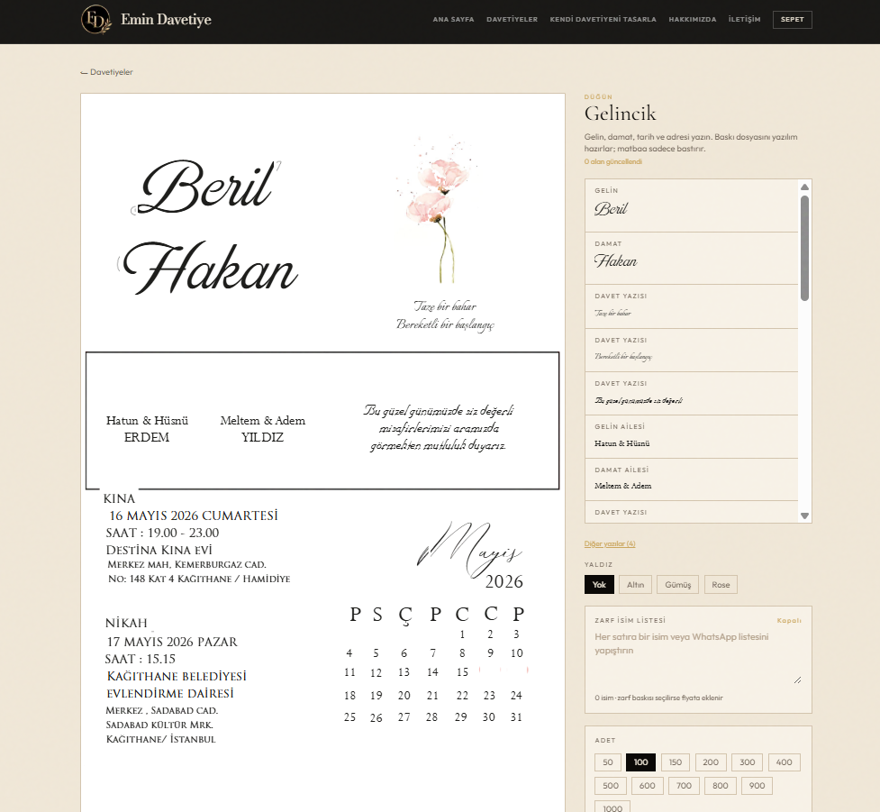
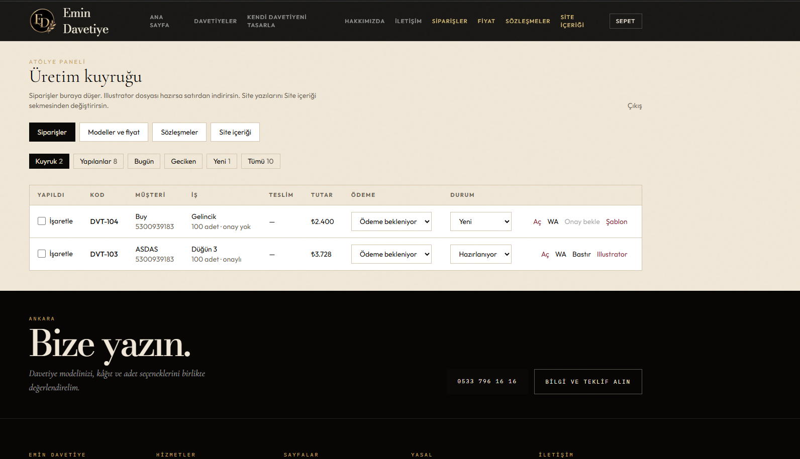
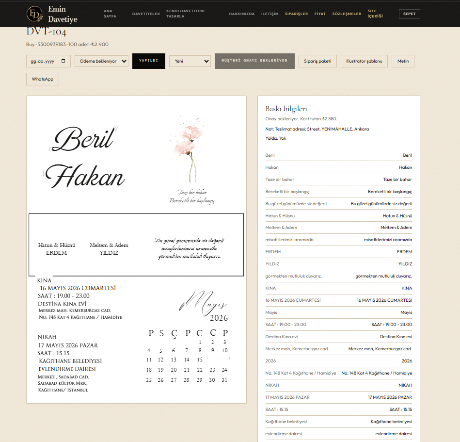
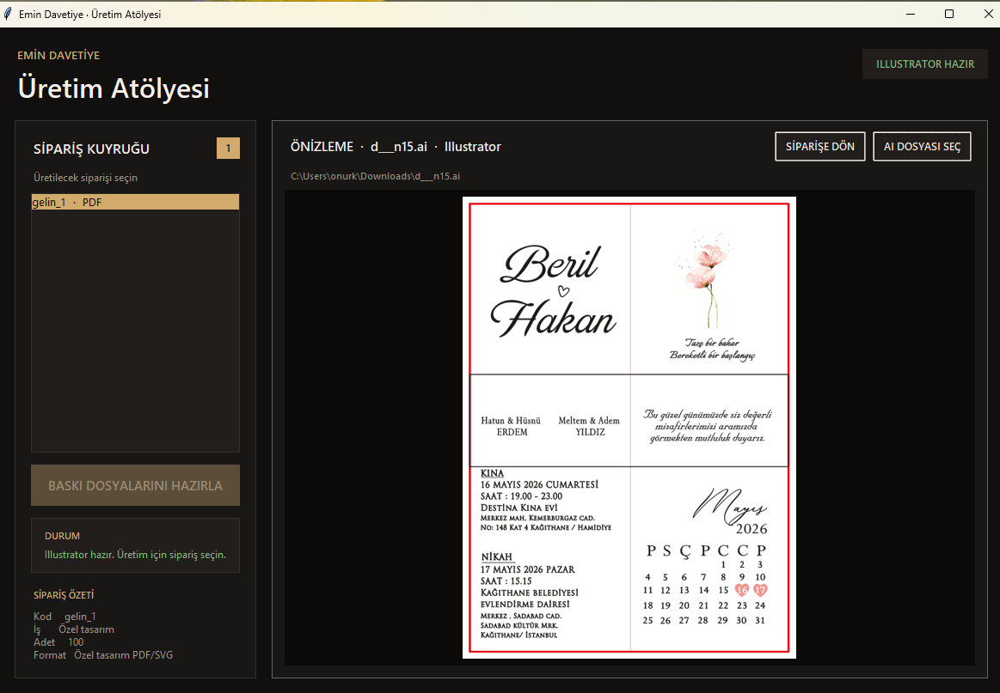
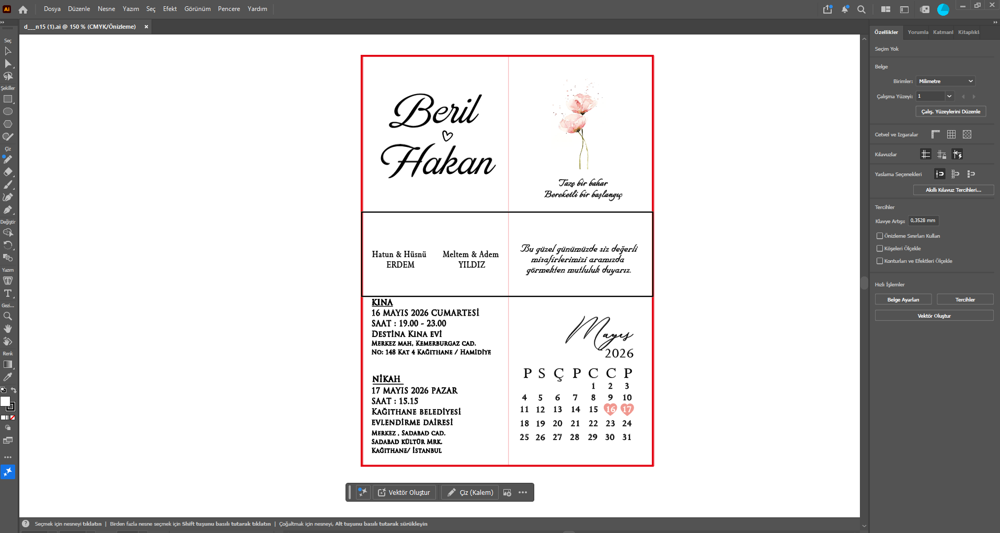

# Web-to-Print Production Automation

A custom web-to-print production system developed by [TankDev](https://tankdev.tech), connecting browser-based product customization, order management, desktop production software, and Adobe Illustrator-based print production in a single workflow.

The system transforms customer-created designs into structured production data and carries that data from the browser to production-ready output.

## System at a Glance

**Customer Design → Order → Production Management → Desktop Production → Adobe Illustrator → Print-Ready Output**

The platform combines:

- Browser-based product personalization
- A custom design editor with 200+ premium SVG assets
- Centralized order and production management
- Structured transfer of design and production data
- Dedicated desktop production software
- Adobe Illustrator-based production workflow
- AI, PDF, and PNG output generation

## Browser-Based Design

Customers can select print products and personalize them directly in the browser.

Two controlled design workflows are supported:

1. Personalization of predefined print products
2. Original design creation using typography, layout tools, and 200+ SVG assets

Product dimensions and production constraints are defined by the printing business rather than by the customer.

### Design Editor

The editor keeps customer-facing design activity connected to the same structured product and order model used by the production workflow.

### Design Preview

The resulting design can be reviewed before it proceeds through the order and production workflow.

## Order & Production Management

When an order is completed, product configuration, dimensions, customer selections, and design data remain connected through a structured order record.

The administrative interface provides a centralized point for managing orders and the information required by the downstream production process.

### Order Details

Individual production jobs retain the information required to move from the web workflow into the production environment.

## Desktop Production & Adobe Illustrator

Approved jobs can be transferred into the dedicated desktop production workflow.

The production application connects structured order and design data with the Adobe Illustrator-based production process, reducing the need to manually reconstruct customer designs during file preparation.

### Print-Ready Output

The workflow supports production output in:

- AI
- PDF
- PNG

## Production Workflow

<pre>
Customer
   │
   ▼
Product Catalog
   │
   ▼
Browser Design & Personalization
   │
   ▼
Order
   │
   ▼
FastAPI Service Layer
   │
   ▼
PostgreSQL
   │
   ▼
Admin & Production Management
   │
   ▼
Desktop Production Application
   │
   ▼
Adobe Illustrator
   │
   ▼
AI / PDF / PNG
</pre>

## Core Capabilities

| Capability | Description |
| --- | --- |
| Live product personalization | Customers modify permitted content directly in the browser with real-time preview |
| Custom design editor | Original designs can be created using typography, layout tools, and 200+ SVG assets |
| Production-aware dimensions | Design areas are constrained by product dimensions defined by the printing business |
| Centralized order data | Product, dimensions, design data, and customer selections remain connected to the same order |
| Admin workflow | Orders and production data are managed through a centralized administrative interface |
| Desktop production | Approved jobs are transferred from the web system to a dedicated production application |
| Illustrator integration | Production data is transferred into the Adobe Illustrator workflow |
| Print-ready generation | Approved designs can be prepared as AI, PDF, or PNG production files |

## Architecture

The system combines web, API, relational data, administrative, and desktop production components around the same order and design model.

<pre>
┌─────────────────────────────┐
│      Customer Interface     │
│           Next.js           │
└──────────────┬──────────────┘
               │
               ▼
┌─────────────────────────────┐
│        FastAPI Layer        │
│ Orders · Designs · Products │
└──────────────┬──────────────┘
               │
               ▼
┌─────────────────────────────┐
│         PostgreSQL          │
│ Structured Production Data  │
└──────────────┬──────────────┘
               │
               ▼
┌─────────────────────────────┐
│         Admin Panel         │
│ Order & Production Control  │
└──────────────┬──────────────┘
               │
               ▼
┌─────────────────────────────┐
│ Desktop Production Software │
└──────────────┬──────────────┘
               │
               ▼
┌─────────────────────────────┐
│      Adobe Illustrator      │
│       AI · PDF · PNG        │
└─────────────────────────────┘
</pre>

## Technology Stack

**Frontend**

- Next.js
- TypeScript
- React
- Tailwind CSS

**Backend**

- Python
- FastAPI
- PostgreSQL

**Production**

- Desktop production application
- Adobe Illustrator integration
- SVG-based design assets
- AI, PDF, and PNG output workflows

## System Scope

The implemented system includes:

- **200+** premium SVG design assets
- **2** customer design workflows
- **7** connected workflow stages
- **3** production output formats
- Browser-based product personalization
- Custom design editor
- Centralized administration
- Desktop production workflow
- Adobe Illustrator integration

These figures describe the implemented system scope rather than commercial or performance KPIs.

## Engineering Approach

The system is designed around a shared order identity and structured design data.

The web interface, API, relational data model, administrative interface, and desktop production application operate around the same underlying production workflow.

Validation is performed before production transfer to ensure required product, dimension, and design information is available.

Sensitive production rules, transformation logic, infrastructure configuration, and implementation details are intentionally excluded from this public repository.

## Documentation

More detailed technical documentation is available in this repository:

- [System Architecture](docs/architecture.md)
- [Production Workflow](docs/workflow.md)

## Case Study

A detailed engineering case study covering the operational problem, system design, workflow, and implementation scope is available on TankDev:

**[Read the Web-to-Print Production Automation Case Study](https://tankdev.tech/tr/case-studies/print-production-automation)**

## System Overview

A product-oriented overview of the system and its capabilities is also available:

**[Explore the Print Production Automation System](https://tankdev.tech/tr/systems/print-production-automation)**

## Public Documentation Boundary

This repository is a public technical showcase of a proprietary TankDev system.

It documents the system architecture, production workflow, interface, and implemented capabilities without exposing production source code.

Production source code, credentials, infrastructure configuration, customer data, sensitive production rules, and proprietary transformation logic are not included.

## About TankDev

[TankDev](https://tankdev.tech) is a software engineering organization focused on custom software systems, applied artificial intelligence, process automation, web applications, and system integration.

**Software Engineering · Applied AI · Process Automation**

---

Developed by **[TankDev](https://tankdev.tech)**  
[Website](https://tankdev.tech) · [Case Studies](https://tankdev.tech/tr/case-studies)
